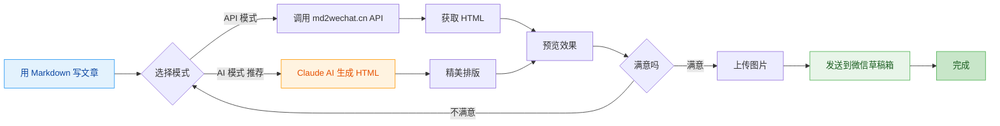
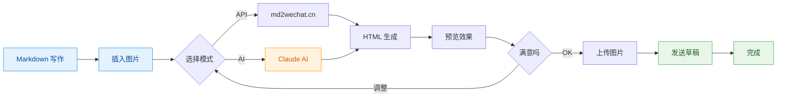

# md2wechat

<div align="center">

**用 Markdown 写公众号文章，像发朋友圈一样简单**

[](https://golang.org)
[](LICENSE)
[](https://github.com/geekjourneyx/md2wechat-skill/releases)

[快速开始](#-5分钟快速上手) • [功能介绍](#-核心功能) • [使用说明](#-使用方法) • [常见问题](#-常见问题)

</div>

---

## ✨ 这是什么？

**md2wechat** 是一个让你的微信公众号写作更高效的神器。

> 💡 **一句话理解**：用 Markdown 写文章 → 一键转换 → 自动发到微信草稿箱

**适合谁用？**

| 你是 | 痛点 | md2wechat 帮你 |
|------|------|---------------|
| 📝 内容创作者 | 微信编辑器太难用，排版花时间 | Markdown 写作，自动排版 |
| 💼 产品经理 | 要发公告，但不会 HTML | 不用学代码，一行命令搞定 |
| 👨‍💻 程序员 | 习惯 Markdown，讨厌微信编辑器 | 保持你的写作习惯 |
| 🤖 AI 用户 | 用 AI 生成内容，但要手动复制粘贴 | AI 生成 → 微信草稿，无缝衔接 |

---

## 🎯 核心功能



### 两种转换模式

| 模式 | 适合谁 | 特点 | 样式 |
|------|--------|------|------|
| **API 模式** | 追求稳定、快速 | 调用 md2wechat.cn API，秒级响应 | 简洁专业 |
| **AI 模式** ⭐ | 追求精美排版 | Claude AI 生成，样式更丰富 | 秋日暖光 / 春日清新 / 深海静谧 |

### 完整工作流程



---

## 🚀 5分钟快速上手

### 第一步：下载软件

> 💡 **最新版本**：访问 [Releases 页面](https://github.com/geekjourneyx/md2wechat-skill/releases) 下载

| 你的系统 | 下载链接 | 说明 |
|----------|----------|------|
| 🪟 **Windows** | [下载 .exe](https://github.com/geekjourneyx/md2wechat-skill/releases/latest/download/md2wechat-windows-amd64.exe) | 双击运行 |
| 🍎 **Mac Intel** | [下载](https://github.com/geekjourneyx/md2wechat-skill/releases/latest/download/md2wechat-darwin-amd64) | 终端运行 |
| 🍎 **Mac M1/M2** | [下载](https://github.com/geekjourneyx/md2wechat-skill/releases/latest/download/md2wechat-darwin-arm64) | 终端运行 |
| 🐧 **Linux** | [下载](https://github.com/geekjourneyx/md2wechat-skill/releases/latest/download/md2wechat-linux-amd64) | 放到 `/usr/local/bin` |

> ⚠️ **Mac 用户**：下载后如果提示「无法打开」，右键点击 → 打开 → 仍要打开

### 第二步：配置微信（只需一次）

```bash
md2wechat config init
```

用记事本打开生成的配置文件（会显示路径），填入两个信息：

| 配置项 | 是什么 | 在哪获取 |
|--------|--------|----------|
| AppID | 公众号唯一标识 | mp.weixin.qq.com → 设置与开发 → 基本配置 |
| Secret | API 密钥 | 同上，需要管理员权限 |

### 第三步：开始使用

```bash
# 1. 用 Markdown 写好文章（假设文件叫 article.md）

# 2. 预览效果
md2wechat convert article.md --preview

# 3. 发送到微信草稿箱
md2wechat convert article.md --draft --cover cover.jpg
```

> 💡 **小贴士**：第一次使用时，命令会自动引导你完成配置。

---

## 📖 使用方法

### 基础命令

```bash
# 预览转换效果（不发送）
md2wechat convert article.md --preview

# 转换并保存为 HTML 文件
md2wechat convert article.md -o output.html

# 使用 AI 模式生成精美排版
md2wechat convert article.md --mode ai --theme autumn-warm --preview
```

### 完整发布流程

```bash
# 一步到位：转换 + 上传图片 + 发送草稿
md2wechat convert article.md --draft --cover cover.jpg

# 流程说明：
# 1. 将 Markdown 转换为微信格式 HTML
# 2. 上传封面图片到微信素材库
# 3. 创建草稿并推送到微信后台
```

### AI 模式主题选择

| 主题名 | 命令 | 风格 | 适合内容 |
|--------|------|------|----------|
| 🟠 **秋日暖光** | `--theme autumn-warm` | 温暖橙色调 | 情感故事、生活随笔 |
| 🟢 **春日清新** | `--theme spring-fresh` | 清新绿色调 | 旅行日记、自然主题 |
| 🔵 **深海静谧** | `--theme ocean-calm` | 专业蓝色调 | 技术文章、商业分析 |

### 图片处理

```bash
# 上传单张图片到微信素材库
md2wechat upload_image photo.jpg

# 下载网络图片并上传
md2wechat download_and_upload https://example.com/image.jpg
```

---

## 🤖 AI 模式详解

### 什么是 AI 模式？

**AI 模式**使用 Claude 大模型来生成精美的公众号排版，而不是简单的 API 转换。

```
┌─────────────────────────────────────────────────────────────┐
│                     AI 模式工作流程                          │
├─────────────────────────────────────────────────────────────┤
│                                                             │
│   1. 你用 Markdown 写文章                                    │
│              ↓                                               │
│   2. md2wechat 提取文章结构                                  │
│              ↓                                               │
│   3. 构建专业的排版提示词 (Prompt)                           │
│              ↓                                               │
│   4. Claude AI 根据提示词生成 HTML                          │
│              ↓                                               │
│   5. 返回符合微信规范的 HTML                                 │
│                                                             │
└─────────────────────────────────────────────────────────────┘
```

### AI 模式的优势

| 对比项 | API 模式 | AI 模式 |
|--------|----------|----------|
| 响应速度 | ⚡ 秒级 | 🐢 10-30秒 |
| 排版质量 | 👍 标准规范 | 🌟 精美多样 |
| 样式选择 | 2-3 种 | 无限可能 |
| 成本 | 低 | 使用 Claude AI |
| 适合场景 | 日常文章 | 重要文章、品牌内容 |

### 在 Claude Code 中使用 AI 模式

如果你使用 **Claude Code**，AI 模式会自动调用内置的 Claude，无需额外配置：

```bash
# 在 Claude Code 中直接运行
md2wechat convert article.md --mode ai --theme autumn-warm
```

---

## ⚙️ 配置说明

### 配置文件位置

```
~/.config/md2wechat/config.yaml    # 全局配置（推荐）
```

### 配置项说明

```yaml
# 微信公众号配置（必需）
wechat:
  appid: "你的AppID"
  secret: "你的Secret"

# API 配置
api:
  md2wechat_key: "md2wechat.cn 的 API Key"  # API 模式需要
  convert_mode: "api"                       # 默认模式：api 或 ai
  default_theme: "default"                  # 默认主题
  http_timeout: 30                          # 超时时间（秒）

# 图片处理配置
image:
  compress: true           # 自动压缩大图
  max_width: 1920         # 最大宽度
  max_size_mb: 5          # 最大文件大小（MB）
```

---

## 📁 项目结构

```
md2wechat-skill/
├── cmd/                    # 命令行工具
│   └── md2wechat/         # 主程序
├── internal/              # 核心功能模块
│   ├── converter/        # 转换器（API/AI）
│   ├── draft/            # 草稿服务
│   ├── image/            # 图片处理
│   ├── wechat/           # 微信 API 封装
│   └── config/           # 配置管理
├── docs/                 # 详细文档
│   ├── USAGE.md          # 使用教程
│   ├── FAQ.md            # 常见问题
│   └── TROUBLESHOOTING.md # 故障排查
├── examples/             # 示例文章
├── scripts/              # 安装脚本
└── bin/                  # 编译好的二进制文件
```

---

## 🔧 高级安装

### 方式一：Go 工具链

```bash
go install github.com/geekjourneyx/md2wechat-skill/cmd/md2wechat@latest
```

### 方式二：一键安装脚本

**Mac/Linux：**
```bash
curl -fsSL https://raw.githubusercontent.com/geekjourneyx/md2wechat-skill/main/scripts/install.sh | bash
```

**Windows PowerShell：**
```powershell
Set-ExecutionPolicy Bypass -Scope Process -Force
iex ((New-Object System.Net.WebClient).DownloadString('https://raw.githubusercontent.com/geekjourneyx/md2wechat-skill/main/scripts/install.ps1'))
```

### 方式三：从源码编译

```bash
git clone https://github.com/geekjourneyx/md2wechat-skill.git
cd md2wechat-skill
make build
```

---

## 🎓 使用示例

### 示例 1：技术博主

```bash
# 写好技术文章
vim my-tech-post.md

# 使用简洁的 API 模式转换
md2wechat convert my-tech-post.md --preview

# 满意后发送草稿
md2wechat convert my-tech-post.md --draft --cover cover.jpg
```

### 示例 2：产品经理发公告

```bash
# AI 生成产品公告内容，然后
md2wechat convert announcement.md --mode ai --theme ocean-calm --draft --cover product-logo.png
```

### 示例 3：生活方式博主

```bash
# 使用春日清新主题
md2wechat travel-diary.md --mode ai --theme spring-fresh --preview
```

---

## ❓ 常见问题

<details>
<summary><b>Q: 必须要会编程才能用吗？</b></summary>

**A: 不需要！** 只要会用命令行（终端）就可以。如果是 Windows 用户，下载 .exe 文件后，在 CMD 或 PowerShell 中运行命令即可。
</details>

<details>
<summary><b>Q: AI 模式需要付费吗？</b></summary>

**A:** AI 模式使用 Claude 能力：
- 如果你在 **Claude Code** 中使用，直接调用内置 AI
- 如果你想自己接入，需要配置 OpenAI 兼容的 API
</details>

<details>
<summary><b>Q: 支持哪些 Markdown 语法？</b></summary>

**A:** 支持常用语法：
- 标题（# ## ###）
- 列表（无序、有序）
- 粗体、斜体、行内代码
- 代码块（带语法高亮）
- 引用块
- 分割线
- 图片、链接
- 表格
</details>

<details>
<summary><b>Q: 生成的文章可以直接在微信编辑器中编辑吗？</b></summary>

**A:** 可以！草稿发送后，你可以登录微信公众平台，在草稿箱中继续编辑。
</details>

---

## 📚 更多文档

| 文档 | 说明 |
|------|------|
| [新手入门指南](QUICKSTART.md) | **强烈推荐！** 详细的图文教程 |
| [完整使用说明](docs/USAGE.md) | 所有命令和选项 |
| [常见问题](docs/FAQ.md) | 20+ 常见问题解答 |
| [故障排查](docs/TROUBLESHOOTING.md) | 遇到问题看这里 |

---

## 🤝 贡献

欢迎提交 Issue 和 Pull Request！

如果你有好的想法或发现了 bug，请随时提 issue。

---

## 📄 许可证

[MIT License](LICENSE)

---

## 👨‍💻 作者

**geekjourney** — 极客/创作者/AI 探索者

- 🌐 个人主页: [geekjourney.dev](https://geekjourney.dev)
- 🐦 X/Twitter: [@seekjourney](https://x.com/seekjourney/)
- 📱 公众号: **极客杰尼**

---

<div align="center">

**让公众号写作更简单** ⭐

[主页](https://github.com/geekjourneyx/md2wechat-skill) • [文档](docs) • [反馈](https://github.com/geekjourneyx/md2wechat-skill/issues)

Made with ❤️ by [geekjourney](https://geekjourney.dev)

</div>
